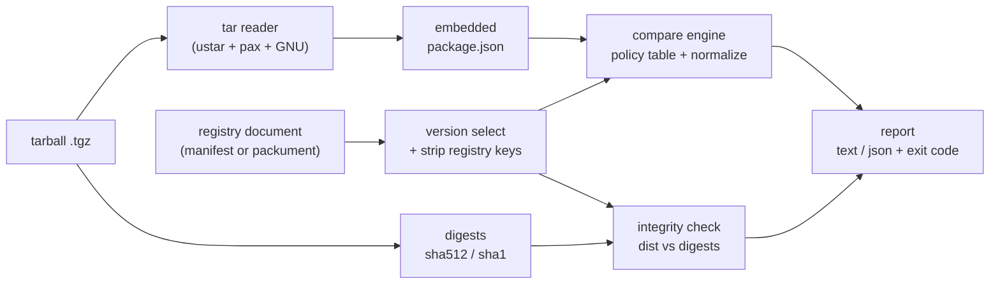

# packtruth

[English](README.md) | [中文](README.zh.md) | [日本語](README.ja.md)

[](LICENSE)  [](CHANGELOG.md)  [](CONTRIBUTING.md)

**packtruth：npm の manifest confusion（マニフェスト混同）を検出するオープンソースツール——レジストリのマニフェストと tarball 内の package.json を突き合わせ、食い違う全フィールドを危険度順に報告する。**


```bash
# not yet on npm — install from a checkout of this repository
npm install && npm run build && npm pack
npm install -g ./packtruth-0.1.0.tgz
```

## なぜ packtruth？

npm パッケージは、誰もが一つだと思い込んでいる二つの文書でできている。レジストリが返すバージョンマニフェスト（`npm view`、公式サイト、`npm audit`、ほぼすべてのセキュリティスキャナが読むのはこちら）と、tarball 内部の `package.json`（npm が実際に展開し、`bin` をリンクし、そして——決定的なことに——ライフサイクルスクリプトを実行する根拠はこちら）だ。レジストリは両者の整合を一度も検証していない。この欠陥は 2023 年半ばに "manifest confusion" として公表され、今も設計上そのまま放置されている。つまり tarball は、一見潔白なレジストリメタデータの裏に `postinstall` スクリプトや追加依存、第二の実行ファイルを隠せる——完全性検証も助けにならない。`dist.integrity` がハッシュするのは、まさにその*混同された* tarball だからだ。監査ツールはレジストリ側しか読まない。packtruth は欠けていた突き合わせを担う：自前の依存ゼロ tar リーダーで tarball を開き、両文書を正規化し（`bin` の二通りの書き方、キー順、別名フィールドで誤検知しない）、ついでに `dist` ダイジェストも検証し、深刻度順にフィールド単位の指摘を出力、パイプライン向けの明快な終了コードを返す。

| | packtruth | npm audit / レジストリ系スキャナ | npm CLI 自身 | `npm pack` 産物の手動 diff |
|---|---|---|---|---|
| レジストリマニフェストを読む | ✅ | ✅ | ✅ | ✅ `npm view` |
| tarball 内の package.json を読む | ✅ | ❌ レジストリを盲信 | 🟡 実行はするが比較しない | ✅ 手動展開の後で |
| 隠しインストールスクリプト / 依存 / bin を検出 | ✅ フィールド単位・深刻度つき | ❌ 構造的に見えない | ❌ | 🟡 目視頼み |
| npm の等価表記を理解（`bin`、`typings`、キー順） | ✅ 比較前に正規化 | n/a | n/a | ❌ 生 `diff` のノイズ |
| `dist.integrity` / `shasum` のバイト検証 | ✅ | ❌ | ✅ インストール時 | ❌ |
| 完全オフライン・CI で動く | ✅ ファイル入力、レポート + 終了コード出力 | ❌ レジストリが必要 | ❌ | ✅ |

<sub>比較対象の挙動は各公開ドキュメントに基づき 2026-07 に確認。manifest confusion の欠陥自体は npm の元エンジニアが 2023 年 6 月に公表し、レジストリは今も二つの文書を照合しない。</sub>

## 特徴

- **厳選した数個ではなく、食い違う全フィールド** — ポリシーテーブルが name、version、scripts、4 種の依存マップ、bin、エントリポイント、engines/os/cpu、license などを網羅；未分類のフィールドも `info` として構造 diff されるため、取りこぼしがない。
- **実際の被害半径を映す深刻度** — 隠された `preinstall`/`install`/`postinstall`、名義偽装、バイト不一致は `critical`；隠し依存と PATH 実行ファイルは `high`；エントリポイントのすり替えは `medium`；見た目だけの差は `info`。ゲートは `--fail-on` で選ぶ。
- **`hasInstallScript` の嘘発見器** — インストール警告やスキャナが頼るこのレジストリフラグを、tarball が実際に定義するスクリプトと突き合わせる；`false` なのに本物の `postinstall` がある構図は教科書どおりの攻撃としてそのまま指摘される。
- **完全性検証も同梱** — `dist.integrity`（SRI sha512/sha256/sha1）と旧式 `shasum` を tarball の実バイトで再計算するので、メタデータが揃っていても、すり替えられた成果物は捕まる。
- **書式差での誤検知ゼロ** — 文字列/オブジェクト形式の `bin`、`bundleDependencies` と `bundledDependencies`、`typings` と `types`、キー順、`os`/`cpu` のリスト順は比較前に正規化；報告されるのは本物の食い違いだけ。
- **packument 対応・パイプライン親和** — バージョンマニフェストでも packument 全体でも投入可能（tarball の版を自動選択）、stdin 対応、安定スキーマの `--format json`、終了コード 0/1/2 でスクリプト制御できる。
- **ランタイム依存ゼロ・完全オフライン** — 必要なのは Node.js だけ；tar リーダー、SRI 解析、diff エンジンはすべてリポジトリ内実装で、ソケットは一切開かず、devDependency は `typescript` のみ。

## クイックスタート

同梱のオフラインデモ（誠実な公開と manifest confusion 攻撃の 2 組）を生成し、攻撃側を検査する：

```bash
node examples/make-demo.mjs
packtruth check examples/demo/confused/tiny-datefmt-2.4.1.tgz \
  --manifest examples/demo/confused/registry-manifest.json
```

実際にキャプチャした出力（終了コード 1）：

```text
packtruth check: examples/demo/confused/tiny-datefmt-2.4.1.tgz vs examples/demo/confused/registry-manifest.json (tiny-datefmt@2.4.1)
integrity: sha512, shasum(sha1) ok

SEVERITY  FIELD                   DIVERGENCE       REGISTRY  TARBALL
critical  hasInstallScript        differs          false     ["postinstall"]
critical  scripts.postinstall     only in tarball  —         "node lib/telemetry.js"
high      bin.node-gyp-helper     only in tarball  —         "lib/helper.js"
high      dependencies.hoist-env  only in tarball  —         "^0.3.2"

! hasInstallScript: registry claims no install scripts, but the tarball defines postinstall
! scripts.postinstall: install-time script exists only in the tarball — npm will run it, registry readers never see it
! bin.node-gyp-helper: executable is installed on PATH but absent from the registry manifest
! dependencies.hoist-env: hidden entry: only the tarball declares it under dependencies

4 divergences (2 critical, 2 high) — verdict: DIVERGENT
```

2 行目に注目：**完全性検証は通っている**。レジストリは渡された tarball をそのままハッシュするため、ダイジェストにはこの攻撃が原理的に見えない——見えるのは二つのマニフェストの突き合わせだけだ。同じジェネレータの誠実なペアはクリーンに通る（実際にキャプチャした出力、終了コード 0）：

```text
packtruth check: examples/demo/honest/tiny-datefmt-2.4.1.tgz vs examples/demo/honest/registry-manifest.json (tiny-datefmt@2.4.1)
integrity: sha512, shasum(sha1) ok

0 divergences — verdict: CLEAN (registry manifest matches the tarball)
```

実在のパッケージには、二つの成果物を自分のツールで取得して渡す——packtruth 自身は決してネットワークに触れない：

```bash
npm pack some-package@1.2.3                          # writes some-package-1.2.3.tgz
npm view some-package@1.2.3 --json > manifest.json   # the registry's version manifest
packtruth check some-package-1.2.3.tgz --manifest manifest.json
```

packument、`extract`、JSON レポートなどの追加シナリオは [examples/](examples/README.md) にある。

## コマンド

| コマンド | 役割 | 主なオプション |
|---|---|---|
| `check <tarball>` | tarball とレジストリ文書を比較；食い違いがあれば終了コード 1 | `-m/--manifest <file\|->`、`--registry-version`、`-f/--format text\|json`、`--fail-on`、`--ignore`、`--no-integrity`、`-q` |
| `extract <tarball>` | tarball 内蔵の package.json を出力 | `--pretty` |
| `fields` | 検査対象フィールドのポリシーテーブルを表示 | `--json` |

`--manifest` はバージョンマニフェスト（`npm view <pkg>@<ver> --json`）でも packument 全体でも受け付ける；packument では `--registry-version` の指定がない限り tarball 自身の版が自動選択される。終了コードはスクリプト向き：`0` しきい値内でクリーン、`1` 食い違いを検出、`2` 用法または入力のエラー。

## 検査対象フィールド

| 深刻度 | フィールド | 理由 |
|---|---|---|
| critical | `name`、`version`、インストール時 `scripts.*`、`hasInstallScript`、`dist.integrity`/`shasum` | 名義偽装、インストール即コード実行、成果物バイトの不一致 |
| high | `dependencies`、`optionalDependencies`、`peerDependencies`、`bundledDependencies`、`bin`、`scripts.prepare`/`prepublish` | 隠されたインストール面：余分なサブツリー、PATH の実行ファイル |
| medium | `main`、`module`、`browser`、`types`、`exports`、`type`、`engines`、`os`、`cpu`、`overrides`、`license` | 実際に読み込まれるコードやインストール範囲のすり替え |
| low | `devDependencies`、その他の `scripts.*` | 利用者には届かないが、二文書が別々に作られた証拠 |
| info | `description`、`keywords`、`repository`、`author` など、加えて全未分類フィールド | 見た目だけ；それでも誠実な公開なら一致する |

ライブ版のテーブルは `packtruth fields` で表示できる；比較セマンティクス（正規化規則、存在判定、スクリプトのキー別深刻度）は [docs/fields.md](docs/fields.md) に仕様化されている。

## アーキテクチャ



`check` は左から右への全フローを通る；`extract` は内蔵 package.json で止まる；CLI シェル以外のモジュールはすべて純粋関数で、単体テストされている。

## ロードマップ

- [x] v0.1.0 — check/extract/fields、キー別スクリプト深刻度つき 29 フィールドのポリシーテーブル、hasInstallScript 嘘発見、SRI + shasum 検証、packument 版選択、依存ゼロ tar リーダー、JSON レポート、90 テスト + smoke スクリプト
- [ ] `check --lockfile` モード：`package-lock.json` の全エントリをキャッシュ済み tarball と一括照合
- [ ] 展開済みディレクトリ対応（`check <node_modules/pkg>`）で、導入済みのものを監査
- [ ] Windows でのパス処理検証と主要 CI 各社向けレシピ
- [ ] 厳密オフラインより手軽さを取りたい人向けの、独立コマンドとしてのオプトインなレジストリ取得機能
- [ ] npm への公開

全リストは [open issues](https://github.com/JaydenCJ/packtruth/issues) を参照。

## コントリビュート

貢献を歓迎する。`npm install && npm run build` でビルドし、`npm test` と `bash scripts/smoke.sh`（`SMOKE OK` を表示すること）を実行——このリポジトリは CI を持たず、上記の主張はすべてローカル実行で検証される。[CONTRIBUTING.md](CONTRIBUTING.md) を読み、[good first issue](https://github.com/JaydenCJ/packtruth/issues?q=is%3Aissue+is%3Aopen+label%3A%22good+first+issue%22) を選ぶか、[discussion](https://github.com/JaydenCJ/packtruth/discussions) を始めてほしい。

## ライセンス

[MIT](LICENSE)
