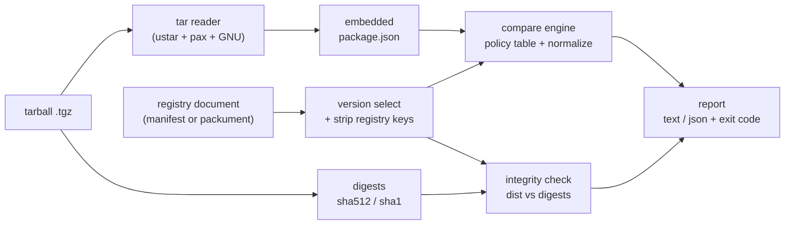

# packtruth

[English](README.md) | [中文](README.zh.md) | [日本語](README.ja.md)

[](LICENSE)  [](CHANGELOG.md)  [](CONTRIBUTING.md)

**packtruth：an open-source detector for npm manifest confusion — it cross-checks the registry manifest against the package.json inside the tarball and reports every divergent field, ranked by how much damage it can do.**


```bash
# not yet on npm — install from a checkout of this repository
npm install && npm run build && npm pack
npm install -g ./packtruth-0.1.0.tgz
```

## Why packtruth?

An npm package is two documents that everyone assumes are one: the version manifest the registry serves (what `npm view`, the website, `npm audit` and virtually every security scanner read) and the `package.json` inside the tarball (what npm actually unpacks, links `bin` entries from, and — crucially — executes lifecycle scripts from). The registry has never validated one against the other; the gap was disclosed as "manifest confusion" in mid-2023 and remains open by design. That means a tarball can hide a `postinstall` script, extra dependencies or a second executable behind registry metadata that looks spotless — and integrity checking won't save you, because `dist.integrity` faithfully hashes the *confused* tarball. Audit tooling reads the registry side only; packtruth is the missing cross-check: it opens the tarball with its own dependency-free tar reader, normalizes both documents (so `bin` spellings, key order and alias fields never false-positive), verifies the `dist` digests for good measure, and prints one severity-ranked finding per divergent field, with clean exit codes for pipelines.

| | packtruth | npm audit / registry scanners | npm CLI itself | hand-diffing `npm pack` output |
|---|---|---|---|---|
| Reads the registry manifest | ✅ | ✅ | ✅ | ✅ `npm view` |
| Reads the package.json inside the tarball | ✅ | ❌ trusts the registry | 🟡 executes it, never compares it | ✅ after manual extraction |
| Flags hidden install scripts / deps / bins | ✅ per-field, severity-ranked | ❌ blind to them by construction | ❌ | 🟡 if your eyes catch it |
| Knows npm's equivalent spellings (`bin`, `typings`, key order) | ✅ normalized before comparing | n/a | n/a | ❌ raw `diff` noise |
| Verifies `dist.integrity` / `shasum` bytes | ✅ | ❌ | ✅ at install | ❌ |
| Works fully offline, in CI | ✅ files in, report + exit code out | ❌ needs the registry | ❌ | ✅ |

<sub>Behavior of the compared approaches checked against their public documentation, 2026-07. The manifest-confusion gap itself was publicly disclosed by npm's former engineering staff in June 2023 and the registry still does not reconcile the two documents.</sub>

## Features

- **Every divergent field, not a curated few** — a policy table covers name, version, scripts, all four dependency maps, bin, entry points, engines/os/cpu, license and more; anything uncategorized still gets a structural diff at `info`, so nothing slips through unlisted.
- **Severity that mirrors real blast radius** — hidden `preinstall`/`install`/`postinstall` scripts, identity lies and wrong bytes are `critical`; hidden dependencies and PATH executables are `high`; entry-point swaps are `medium`; cosmetics are `info`. `--fail-on` picks your gate.
- **The `hasInstallScript` lie detector** — the registry flag that install warnings and scanners rely on is tested against the scripts the tarball actually defines; `false` plus a real `postinstall` is the textbook attack and is flagged as such.
- **Integrity included** — `dist.integrity` (SRI sha512/sha256/sha1) and legacy `shasum` are recomputed over the exact tarball bytes, so a swapped artifact is caught even when the metadata agrees.
- **Zero false positives from formatting** — string vs object `bin`, `bundleDependencies` vs `bundledDependencies`, `typings` vs `types`, key order and `os`/`cpu` list order are normalized before comparison; only real divergence is reported.
- **Packument-aware and pipeline-friendly** — feed a version manifest or a whole packument (auto-selects the tarball's version), read from stdin, emit `--format json` with a stable schema, and script on exit codes 0/1/2.
- **Zero runtime dependencies, fully offline** — Node.js is the only requirement; the tar reader, SRI parsing and diff engine are all in-repo, the tool never opens a socket, and `typescript` is the sole devDependency.

## Quickstart

Generate the bundled offline demo (an honest publish and a manifest-confusion attack), then check the attack:

```bash
node examples/make-demo.mjs
packtruth check examples/demo/confused/tiny-datefmt-2.4.1.tgz \
  --manifest examples/demo/confused/registry-manifest.json
```

Real captured output (exit code 1):

```text
packtruth check: examples/demo/confused/tiny-datefmt-2.4.1.tgz vs examples/demo/confused/registry-manifest.json (tiny-datefmt@2.4.1)
integrity: sha512, shasum(sha1) ok

SEVERITY  FIELD                   DIVERGENCE       REGISTRY  TARBALL
critical  hasInstallScript        differs          false     ["postinstall"]
critical  scripts.postinstall     only in tarball  —         "node lib/telemetry.js"
high      bin.node-gyp-helper     only in tarball  —         "lib/helper.js"
high      dependencies.hoist-env  only in tarball  —         "^0.3.2"

! hasInstallScript: registry claims no install scripts, but the tarball defines postinstall
! scripts.postinstall: install-time script exists only in the tarball — npm will run it, registry readers never see it
! bin.node-gyp-helper: executable is installed on PATH but absent from the registry manifest
! dependencies.hoist-env: hidden entry: only the tarball declares it under dependencies

4 divergences (2 critical, 2 high) — verdict: DIVERGENT
```

Note the second line: **integrity passes**. The registry hashes whatever tarball it was given, so digests cannot see this attack — only cross-checking the two manifests can. The honest pair from the same generator comes back clean (real captured output, exit code 0):

```text
packtruth check: examples/demo/honest/tiny-datefmt-2.4.1.tgz vs examples/demo/honest/registry-manifest.json (tiny-datefmt@2.4.1)
integrity: sha512, shasum(sha1) ok

0 divergences — verdict: CLEAN (registry manifest matches the tarball)
```

Against a real package, fetch the two artifacts with your own tooling — packtruth itself never touches the network:

```bash
npm pack some-package@1.2.3                          # writes some-package-1.2.3.tgz
npm view some-package@1.2.3 --json > manifest.json   # the registry's version manifest
packtruth check some-package-1.2.3.tgz --manifest manifest.json
```

More scenarios — packuments, `extract`, JSON reports — live in [examples/](examples/README.md).

## Commands

| Command | Does | Key options |
|---|---|---|
| `check <tarball>` | compare tarball vs registry document; exit 1 on divergence | `-m/--manifest <file\|->`, `--registry-version`, `-f/--format text\|json`, `--fail-on`, `--ignore`, `--no-integrity`, `-q` |
| `extract <tarball>` | print the package.json embedded in the tarball | `--pretty` |
| `fields` | print the checked-field policy table | `--json` |

`--manifest` accepts a version manifest (`npm view <pkg>@<ver> --json`) or a full packument; for packuments the tarball's own version is selected automatically unless `--registry-version` says otherwise. Exit codes are script-friendly: `0` clean at your threshold, `1` divergence found, `2` usage or input error.

## Checked fields

| Severity | Fields | Why |
|---|---|---|
| critical | `name`, `version`, install-time `scripts.*`, `hasInstallScript`, `dist.integrity`/`shasum` | identity lies, code execution on install, wrong artifact bytes |
| high | `dependencies`, `optionalDependencies`, `peerDependencies`, `bundledDependencies`, `bin`, `scripts.prepare`/`prepublish` | hidden install surface: extra subtrees, PATH executables |
| medium | `main`, `module`, `browser`, `types`, `exports`, `type`, `engines`, `os`, `cpu`, `overrides`, `license` | swaps what code loads or where it installs |
| low | `devDependencies`, other `scripts.*` | not consumer-facing, but the documents were built apart |
| info | `description`, `keywords`, `repository`, `author`, … plus every uncategorized field | cosmetic; honest publishes still match |

The live table is `packtruth fields`; the comparison semantics (normalization rules, presence handling, per-key script severities) are specified in [docs/fields.md](docs/fields.md).

## Architecture



`check` is the full left-to-right flow; `extract` stops at the embedded package.json; every module except the CLI shell is pure and unit-tested in isolation.

## Roadmap

- [x] v0.1.0 — check/extract/fields, 29-field policy table with per-key script severities, hasInstallScript lie detector, SRI + shasum verification, packument version selection, dependency-free tar reader, JSON reports, 90 tests + smoke script
- [ ] `check --lockfile` mode: verify every entry of a `package-lock.json` against its cached tarball in one run
- [ ] Unpacked-directory support (`check <node_modules/pkg>`), for auditing what is already installed
- [ ] Windows-verified path handling and CI recipes for the major providers
- [ ] Opt-in registry fetcher as a separate command, for those who want one-shot convenience over strict offline
- [ ] Publish to npm

See the [open issues](https://github.com/JaydenCJ/packtruth/issues) for the full list.

## Contributing

Contributions are welcome. Build with `npm install && npm run build`, then run `npm test` and `bash scripts/smoke.sh` (must print `SMOKE OK`) — this repository ships no CI, every claim above is verified by local runs. See [CONTRIBUTING.md](CONTRIBUTING.md), grab a [good first issue](https://github.com/JaydenCJ/packtruth/issues?q=is%3Aissue+is%3Aopen+label%3A%22good+first+issue%22), or start a [discussion](https://github.com/JaydenCJ/packtruth/discussions).

## License

[MIT](LICENSE)
