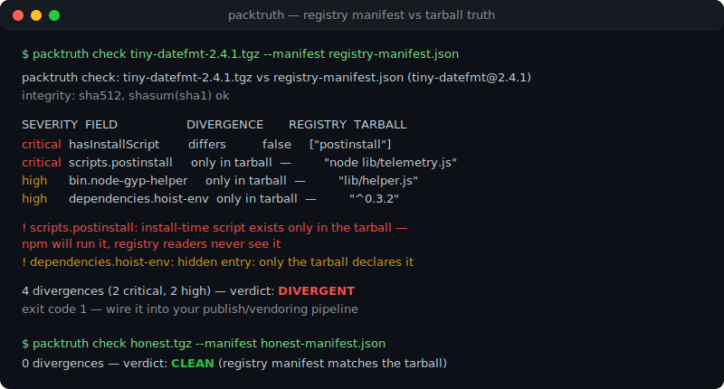
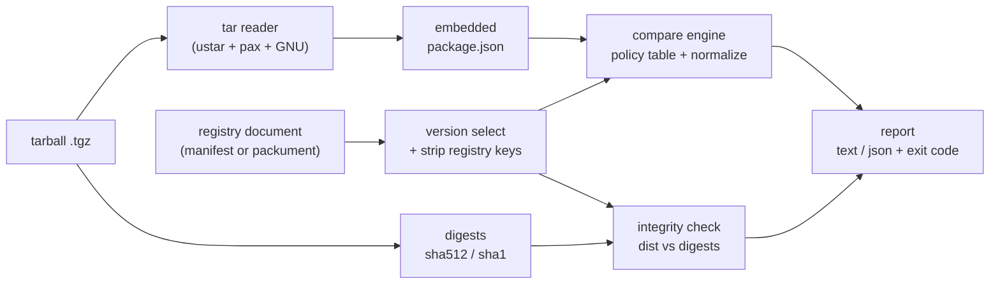

# packtruth

[English](README.md) | [中文](README.zh.md) | [日本語](README.ja.md)

[](LICENSE)  [](CHANGELOG.md)  [](CONTRIBUTING.md)

**packtruth：开源的 npm manifest confusion（清单混淆）检测器——交叉核对 registry 清单与 tarball 内部的 package.json，报告每一个不一致的字段，并按危害程度分级。**



```bash
# not yet on npm — install from a checkout of this repository
npm install && npm run build && npm pack
npm install -g ./packtruth-0.1.0.tgz
```

## 为什么选 packtruth？

一个 npm 包其实是两份被所有人当作一份的文档：registry 提供的版本清单（`npm view`、官网、`npm audit` 和几乎所有安全扫描器读的是它），以及 tarball 内部的 `package.json`（npm 真正解包、链接 `bin`、并且——最关键地——执行生命周期脚本所依据的是它）。registry 从不校验两者是否一致；这个缺口在 2023 年中被披露为 "manifest confusion"，至今仍是设计使然地敞开着。这意味着 tarball 可以在看起来一尘不染的 registry 元数据背后藏起 `postinstall` 脚本、额外依赖或第二个可执行文件——完整性校验也救不了你，因为 `dist.integrity` 忠实地哈希的正是那个*被混淆的* tarball。审计工具只读 registry 一侧；packtruth 补上缺失的交叉核对：它用自带的零依赖 tar 读取器打开 tarball，对两份文档做规范化（`bin` 的两种写法、键顺序、别名字段绝不误报），顺带验证 `dist` 摘要，然后按严重度逐字段输出发现，并以干净的退出码服务流水线。

| | packtruth | npm audit / registry 扫描器 | npm CLI 本身 | 手工 diff `npm pack` 产物 |
|---|---|---|---|---|
| 读取 registry 清单 | ✅ | ✅ | ✅ | ✅ `npm view` |
| 读取 tarball 内部的 package.json | ✅ | ❌ 盲信 registry | 🟡 只执行、从不比较 | ✅ 手动解包之后 |
| 发现隐藏的安装脚本 / 依赖 / bin | ✅ 逐字段、按严重度分级 | ❌ 结构上就看不见 | ❌ | 🟡 全凭眼力 |
| 理解 npm 的等价写法（`bin`、`typings`、键顺序） | ✅ 比较前先规范化 | n/a | n/a | ❌ 原始 `diff` 噪音 |
| 校验 `dist.integrity` / `shasum` 字节 | ✅ | ❌ | ✅ 安装时 | ❌ |
| 完全离线、可进 CI | ✅ 文件进，报告 + 退出码出 | ❌ 需要 registry | ❌ | ✅ |

<sub>各对比方案的行为依据其公开文档核对于 2026-07。manifest confusion 缺口本身由 npm 前工程人员于 2023 年 6 月公开披露，registry 至今不会核对这两份文档。</sub>

## 特性

- **每一个不一致的字段，而非精选几个** — 策略表覆盖 name、version、scripts、全部四张依赖表、bin、入口点、engines/os/cpu、license 等；未收录的字段仍会做结构化 diff（`info` 级），没有任何字段能漏网。
- **严重度映射真实爆炸半径** — 隐藏的 `preinstall`/`install`/`postinstall` 脚本、身份造假与字节不符是 `critical`；隐藏依赖与 PATH 可执行文件是 `high`；入口点掉包是 `medium`；纯装饰是 `info`。`--fail-on` 由你定门槛。
- **`hasInstallScript` 测谎仪** — 安装警告与扫描器所依赖的这个 registry 标志，会被拿去对照 tarball 实际定义的脚本；`false` 加上真实存在的 `postinstall` 正是教科书式攻击，会被如实标记。
- **内置完整性校验** — `dist.integrity`（SRI sha512/sha256/sha1）与旧式 `shasum` 会在 tarball 的真实字节上重新计算，即使元数据一致，被调包的产物也会被抓住。
- **格式差异零误报** — 字符串与对象形式的 `bin`、`bundleDependencies` 与 `bundledDependencies`、`typings` 与 `types`、键顺序、`os`/`cpu` 列表顺序都会先规范化；只报告真正的不一致。
- **懂 packument、亲和流水线** — 可喂版本清单或整份 packument（自动选中 tarball 对应的版本），支持 stdin，`--format json` 输出稳定 schema，退出码 0/1/2 可直接编排。
- **零运行时依赖、完全离线** — 只需要 Node.js；tar 读取器、SRI 解析和 diff 引擎全部在仓库内实现，工具从不打开任何 socket，`typescript` 是唯一的 devDependency。

## 快速上手

生成内置的离线演示（一次诚实发布 + 一次 manifest confusion 攻击），然后检查那次攻击：

```bash
node examples/make-demo.mjs
packtruth check examples/demo/confused/tiny-datefmt-2.4.1.tgz \
  --manifest examples/demo/confused/registry-manifest.json
```

真实捕获的输出（退出码 1）：

```text
packtruth check: examples/demo/confused/tiny-datefmt-2.4.1.tgz vs examples/demo/confused/registry-manifest.json (tiny-datefmt@2.4.1)
integrity: sha512, shasum(sha1) ok

SEVERITY  FIELD                   DIVERGENCE       REGISTRY  TARBALL
critical  hasInstallScript        differs          false     ["postinstall"]
critical  scripts.postinstall     only in tarball  —         "node lib/telemetry.js"
high      bin.node-gyp-helper     only in tarball  —         "lib/helper.js"
high      dependencies.hoist-env  only in tarball  —         "^0.3.2"

! hasInstallScript: registry claims no install scripts, but the tarball defines postinstall
! scripts.postinstall: install-time script exists only in the tarball — npm will run it, registry readers never see it
! bin.node-gyp-helper: executable is installed on PATH but absent from the registry manifest
! dependencies.hoist-env: hidden entry: only the tarball declares it under dependencies

4 divergences (2 critical, 2 high) — verdict: DIVERGENT
```

注意第二行：**完整性校验是通过的**。registry 哈希的就是它收到的那个 tarball，摘要天生看不见这种攻击——只有交叉核对两份清单才行。同一生成器产出的诚实配对则检查干净（真实捕获的输出，退出码 0）：

```text
packtruth check: examples/demo/honest/tiny-datefmt-2.4.1.tgz vs examples/demo/honest/registry-manifest.json (tiny-datefmt@2.4.1)
integrity: sha512, shasum(sha1) ok

0 divergences — verdict: CLEAN (registry manifest matches the tarball)
```

对真实的包，用你自己的工具取回两份产物——packtruth 本身从不联网：

```bash
npm pack some-package@1.2.3                          # writes some-package-1.2.3.tgz
npm view some-package@1.2.3 --json > manifest.json   # the registry's version manifest
packtruth check some-package-1.2.3.tgz --manifest manifest.json
```

更多场景——packument、`extract`、JSON 报告——见 [examples/](examples/README.md)。

## 命令

| 命令 | 作用 | 关键选项 |
|---|---|---|
| `check <tarball>` | 比较 tarball 与 registry 文档；有不一致则退出码 1 | `-m/--manifest <file\|->`、`--registry-version`、`-f/--format text\|json`、`--fail-on`、`--ignore`、`--no-integrity`、`-q` |
| `extract <tarball>` | 打印 tarball 内嵌的 package.json | `--pretty` |
| `fields` | 打印被检查字段的策略表 | `--json` |

`--manifest` 接受版本清单（`npm view <pkg>@<ver> --json`）或整份 packument；对 packument 会自动选中 tarball 自己的版本，除非 `--registry-version` 另有指定。退出码对脚本友好：`0` 在你的阈值下干净，`1` 发现不一致，`2` 用法或输入错误。

## 检查的字段

| 严重度 | 字段 | 原因 |
|---|---|---|
| critical | `name`、`version`、安装期 `scripts.*`、`hasInstallScript`、`dist.integrity`/`shasum` | 身份造假、安装即执行代码、产物字节不符 |
| high | `dependencies`、`optionalDependencies`、`peerDependencies`、`bundledDependencies`、`bin`、`scripts.prepare`/`prepublish` | 隐藏的安装面：额外子树、PATH 可执行文件 |
| medium | `main`、`module`、`browser`、`types`、`exports`、`type`、`engines`、`os`、`cpu`、`overrides`、`license` | 掉包实际加载的代码或安装范围 |
| low | `devDependencies`、其余 `scripts.*` | 不影响使用者，但证明两份文档是分开构建的 |
| info | `description`、`keywords`、`repository`、`author` 等，外加所有未收录字段 | 纯装饰；诚实的发布依然会一致 |

实时表格见 `packtruth fields`；比较语义（规范化规则、存在性处理、脚本按键分级）详见 [docs/fields.md](docs/fields.md)。

## 架构



`check` 走完整个从左到右的流程；`extract` 止步于内嵌的 package.json；除 CLI 外壳之外的每个模块都是纯函数并被独立单测。

## 路线图

- [x] v0.1.0 — check/extract/fields、含按键脚本分级的 29 字段策略表、hasInstallScript 测谎、SRI + shasum 校验、packument 版本选择、零依赖 tar 读取器、JSON 报告、90 个测试 + smoke 脚本
- [ ] `check --lockfile` 模式：一次跑完 `package-lock.json` 的每一项与其缓存 tarball 的核对
- [ ] 已解包目录支持（`check <node_modules/pkg>`），审计已经装好的东西
- [ ] Windows 路径处理验证与主流 CI 平台的接入示例
- [ ] 可选的 registry 拉取器作为独立命令，给想要一步到位而非严格离线的人
- [ ] 发布到 npm

完整列表见 [open issues](https://github.com/JaydenCJ/packtruth/issues)。

## 参与贡献

欢迎贡献。先 `npm install && npm run build`，再跑 `npm test` 与 `bash scripts/smoke.sh`（必须打印 `SMOKE OK`）——本仓库不带 CI，以上所有断言都靠本地运行验证。参见 [CONTRIBUTING.md](CONTRIBUTING.md)，认领一个 [good first issue](https://github.com/JaydenCJ/packtruth/issues?q=is%3Aissue+is%3Aopen+label%3A%22good+first+issue%22)，或发起一场 [discussion](https://github.com/JaydenCJ/packtruth/discussions)。

## 许可证

[MIT](LICENSE)
